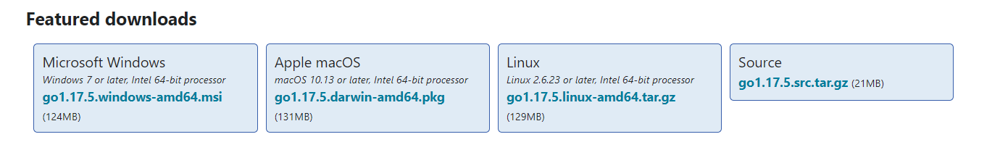

# GO-Guide-Doumbouya

# Installation
# step 1 
	* Téléchargement
		-------------------------Lien----------------------------
		*Lien : https://go.dev/dl/
		Cliquez sur le lien de téléchargement en fonction de notre : go1.17.5.windows-amd64.msi pour Windows par exemple

# step 2
	* Installation
		Installez ensuite go1.17.5.windows-amd64.msi qui vient d'être téléchargé
		Pour vérifier que votre installation s'est bien passé, ouvrez un terminal de command, et tapez : Go, vous devriez voir :

	Sinon, redémarrer votre PC, et tapez à nouveau Go dans votre terminal

# step 3
	* éditeur de texte
	Nous allons télécharger un éditeur de texte pour écrire nos codes, je vous recommande de télécharger VS Code via le lien
	VS Code : (https://code.visualstudio.com/download)
	下载体验(Android)：[点击下载](http://www.flutterj.com/app-release.apk)
	

